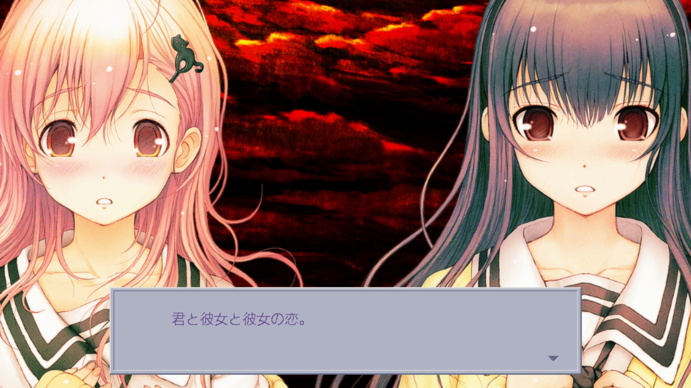

# Totono 感想

## The two interpretations
First I'd like to make a distinction between the two planes on which Totono can be interpreted:
1. "Global" - as a commentary/critique on VN medium and its *consoomers*,
2. "Local" - in the context of this specific VN, which is using its meta-narrative tricks to elicit certain emotions in the player.

## Totono as a commentary

I see three main points that Totono is *maybe* trying to make:

### 1. The unjust, asymmetric relations between a player and heroines
where the player aims to "score" every encountered girl, while they are expected to be loyal to him. (The main point of [this article](https://limprambles.wordpress.com/2020/05/13/totono-the-undertale-of-ntr/)).

My problem with this argument, is that it doesn't really work outside of Totono. Does anyone actually think that exploring multiple routes in VNs (or, as a creator, designing them in such a way to incentivise players to do that) is actually, morally wrong? Or, a weaker statement, that abstaining from such behaviour would result in a more satisfying experience?

It works only when we assume that the characters in the game are conscious people, and after resetting the game, they are thrown into the new route with their memories wiped out. This a good assumption to have while reading Totono, but for other games it doesn't really make sense. In the other games, the whole premise is that the routes are separate stories - that's the whole point of this media, and I don't see anything wrong with this.

This reminds me of a movie "Funny Games" by Michael Haneke (which I recommend). In the movie there is a family who falls victim to two assailants, who abuse and torture them. It is constructed in such a way, to make viewers feel partially responsible for this violence, as they decide to continue watching the movie.

Similar to Totono, there are many interpretations of this movie as a general critique of violence in movies, and again, I don't buy this. I like the meta-narrative and toying with the viewer/player in the context of this specific work, but not as a global statement. 

### 2. Perpetuating gender stereotypes
where it's okay for a man to conquer multiple women, but women doing the same thing are considered "sluts". This is similar to the previous point, but more as an IRL social problem. Well, this is certainly a valid critique, but it wasn't that clearly pronounced in Totono, and I'm not sure if the creators actually were trying to make that point.

### 3. Porn in VNs
Again, I'm not so sure about that. The player is teased/ridiculed multiple times for watching sex scenes, but it might be more in a context of a 1st point - so, it's not the porn itself which is wrong, but being unfaithful to the heroines. Anyway, if this was supposed to be a critique of porn in games in general, it is kind of hypocritical, since this game does the same thing.

Anyway, I don't know much about VNs and the culture around them, so maybe that's why these interpretations don't resonate with me that much. On the other hand...

## Totono as a meta-narrative work of art
Now this is where Totono really shines for me. 

This is a time where we need to assume that the characters are living, conscious people with their own feelings. Obviously, I know there aren't actually little people in my computer, but this is quite natural assumption while consuming a narrative work and we subconsciously do this all the time. The only difference this time is that YOU are also part of the story.

### Miyuki
At the end of "Aoi route", enraged Miyuki murders Shinichi. She accuses you of betrayal and traps you in the version of the game controlled by her, which seems like a sadistic punishment for your infidelity. You're forced to redo the same events for hundreds of times, cannot really save game anymore and at one point you need to repeatedly solve a quiz about Miyuki until you get it right.

In one of the events there is a possibility to talk to God on the phone, who tells you, that in order to escape the loop, you must make Miyuki loose her composure, either by making her really happy, or really angry. "You can't just trap people!" and "fuck off, Miyuki", I thought to myself, and decided to rebel. So for each choice I was repeatedly picking the option which seemed like it would irritate Miyuki. I disagreed with her on every occasion and mentioned Aoi a million times.

Miyuki, as expected, did get gradually more irritated. As she was getting angrier, the music also changed into more sinister. Persistently aggravating her finally resulted in another bloodbath, where she repeatedly murders Shinichi a few times.

But, as I got to know more about her point of view, I started to sympathize with her. In one scene, she literally begs you for a kiss, repeating the line for like ten times. I was still determined to make her as angry as possible, so I resisted, but it started to feel wrong.

At first it seems like she's just mad from jealousy (like what is your problem? I didn't promise you anything, that was the other route!), but then you realize her motivations are much deeper. By reading her diary on her phone you learn that in the "Miyuki route" she already knew that the world is a game, and learned how to preserve her memories between routes. Later she also reveals that she is in fact cursed to either be with Shinichi or be unhappy. She actually explored ALL the possible endings where she doesn't end up with Shinichi and she wasn't happy in any of them. She is disillusioned with the world and puts up a tragic fight. The loop isn't supposed to be a mere punishment for the player, Miyuki actually wants to stay in there together with you, because she is afraid, that if you had a choice, you wouldn't choose her. And she just wants to be loved.

### You
The further the story progresses, the clearer the distinction between YOU (the player) and Shinichi becomes. The distinction appears first in the murder scene at the end of Aoi route. Miyuki suddenly looks straight into the camera and starts talking to YOU.

When she speaks to YOU, she uses "kimi" and continues to do that consistently for the rest of the game (now it is also finally revealed, who is actually the "kimi" in "Kimi to kanojo to kanojo no koi"!). Also, when Shinichi isn't around (i.e. dead or sleeping), the lines are voice-only, since the text box represents what Shinichi thinks and perceives.

Except for the choices, which are the way for YOU to be present in the story. This is very apparent near the ending, where you follow the cat to the roof, and the whole narration switches to "choices" (which are not actually choices, since there is only one line to choose). This implies that what you read is no longer presented to you as something that Shinichi perceives, it is now YOU doing and seeing things.

Later in the story Shinichi becomes an absolutely useless puppet. He he has his memories wiped out every night, Miyuki completely disregards him, talking to YOU instead, while he tries to figure out what's going on, and he even gets murdered a few times (depending on your choices I guess). Gradually it becomes apparent, that Miyuki doesn't actually love Shinichi, but she loves YOU instead.

In one scene, Miyuki asked Shinichi if he loves her, and he replies "yes" (without giving player a choice), but Miyuki isn't satisfied. She has the control over the world, and she can program Shinichi to reply as she wish, so it doesn't feel honest. Then she asks YOU if you love her, now giving you a choice, and asks you to answer honestly. She wants to be loved by an actual person with a free will, and she doesn't view Shinichi in that way anymore. When you reply "yes", she says that she knows she has no guarantee that this is true, but she decides to believe this.

Does Miyuki actually love you? After all, she doesn't really know you. You just happen to be the only person in this world, whose feelings have any weight, the only person who can truly acknowledge her. Her love seems like a very vague, abstract feeling, akin maybe to how many people say they love God (who YOU, in a sense, are in Totono's world).

The culmination of your relation with Miyuki is the sex scene, where, unlike before, Shinichi is not present at all. It's just YOU and Miyuki.

> 一緒に、エッチ……しよ？
> 
> 恥ずかしがらなくて、いいんだよ？
> 
> 心一なしで、直接、繋がろう？

The whole scene is basically a voiced-only monologue of Miyuki, in a way resembling some mystical rambling (in a sense, this is after all an intercourse with God!). I generally don't like the sex scenes in VNs (uhh do people actually masturbate to this? maybe the critique of VN's consoomers was justified after all...), but this scene was so emotionally impactful, that I watched the whole thing with my jaw on the floor.

### Aoi

Unfortunately, I think that Aoi is a rather weak character. I mean, she's fun and cute, but she doesn't really have much of a personality besides that. It felt really weird and forced when Shinichi fell in love with her. This might have been intentional, as the whole point of Shinichi is that he's just an avatar and can fall in love with whoever, depending on player's choices. But then in the end Aoi is supposed to be a valid rival to Miyuki.

I wish Aoi was more interesting, so that she would be a more valid option in the end. I saw that a lot of people actually chose Aoi, so I guess this might be just my impression, but I felt like the whole buildup to the final choice was built around your relation to Miyuki: Do you accept her? Do you forgive her? Do you empathize with her? If not, you can choose Aoi, but she herself doesn't seem like a very appealing option.

### The choice

The game tries very hard to convince you that the final choice is important and that you cannot redo it. Why does it do that?

This is important, because the act of making a choice itself changes the way you think. It matters, because it is a declaration you make before yourself. You can see the other ending later, but it's not YOUR ending, it's not the thing YOU chose. Also, because the choice is irreversible, the heroines can, at least this one time, trust that it is your honest decision.

As it is likely obvious already, I chose Miyuki. I didn't see Aoi ending, but I saw other people writing about it, so I have I general idea of what it's about. It seems like the Aoi ending is more in the spirit of the "global" interpretation of Totono's message, while Miyuki ending stays more in the context of the story. I agree that the Miyuki ending seems kind of basic, but it feels satisfying to me, I'm just glad she got a happy resolution. As I don't care too much about the "global" interpretation of Totono (i.e. extending onto other games), I find it quite fitting that I got this ending.

## Final thoughts
Although I feel like the main points Totono is trying to make don't resonate with me that much, I liked it simply as a very engaging and interesting experience. 

Some other random things I liked:
- many powerful scenes: ending of "Aoi route", reading Miyuki's diary, fake endings with credits rolling for a few seconds, being killed multiple times in the loop, sex scene with YOU, final scene on the roof
- all the 4th wall breaks, I got the chills every time Miyuki suddenly stared into my soul and talked to me while Shinichi was asleep
- Yuutaro is the best, I loved it every time when his theme started playing and I knew he was about to come and talk about some utter nonsense
- many small jokes/references, like Aoi trying to prove the world is a game by stripping down to show a "mosaic"
- seeing Miyuki get gradually more irritated each time you buy her the same cookbook
- art overall was pretty good
- るる
- EROS!

